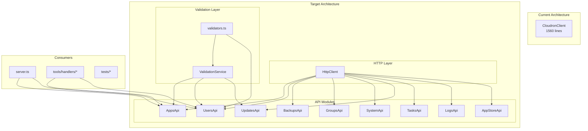
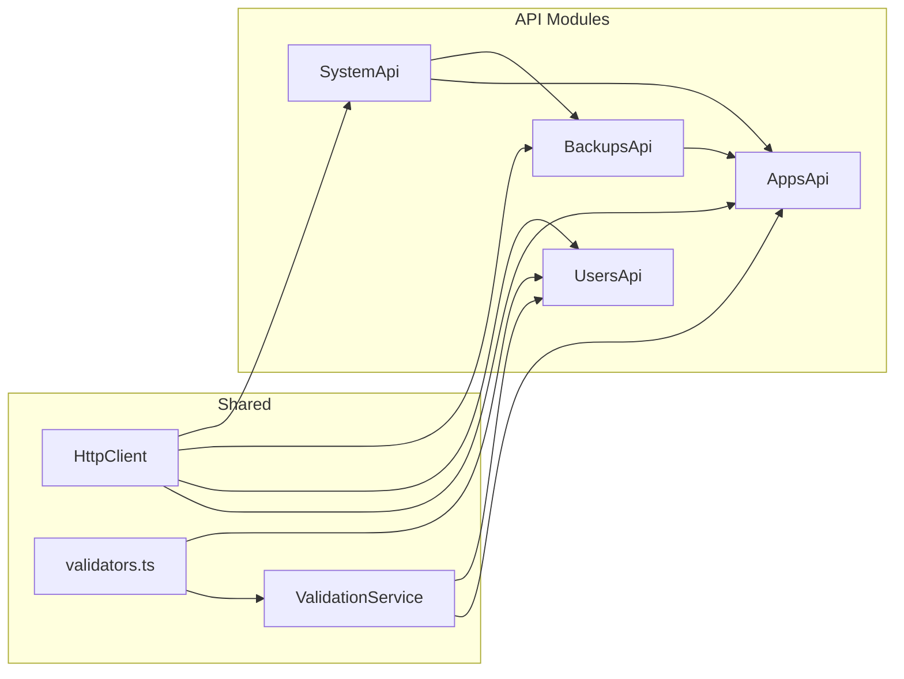

# Plan: Refactor CloudronClient God Class

## Background Information

The [`CloudronClient`](src/cloudron-client.ts:55) class in `src/cloudron-client.ts` is a 1560-line "god class" that handles all Cloudron API interactions. It currently contains:

1. **HTTP Infrastructure** (lines 86-153): Core [`makeRequest()`](src/cloudron-client.ts:86) method for API calls
2. **App Management** (lines 161-486, 929-1137): 15+ methods for app CRUD, control, and lifecycle
3. **Backup Operations** (lines 198-246): Backup listing and creation
4. **User Management** (lines 253-331, 1162-1248): User CRUD operations
5. **Group Management** (lines 1257-1280): Group listing and creation
6. **Domain Operations** (lines 338-344): Domain listing
7. **Service Operations** (lines 1146-1152): Service listing
8. **System Operations** (lines 186-191, 625-655): Status and storage checks
9. **Update Management** (lines 1289-1384): Platform update operations
10. **Validation Logic** (lines 663-921, 1392-1559): Pre-flight validation for destructive operations
11. **Utility Methods** (lines 351-617): Email/password validation, log parsing

The class violates the Single Responsibility Principle and makes testing, maintenance, and extension difficult.

**Note**: Per AGENTS.md, this is an INTERNAL project with no backward compatibility requirements.

## Problem Statement

1. **God Class Anti-Pattern**: Single class with 1560 lines handling 10+ distinct concerns
2. **Validation Logic Tightly Coupled**: Pre-flight validation is embedded within the client, making it non-reusable
3. **Testing Complexity**: Tests must mock the entire client even when testing a single concern
4. **Poor Separation of Concerns**: HTTP infrastructure mixed with business logic and validation
5. **Difficult to Extend**: Adding new API endpoints requires modifying the monolithic class

## Success Criteria

1. **Modular Architecture**: Separate files for each functional group (apps, users, backups, etc.)
2. **Reusable Validation Module**: Standalone validation service that can be used independently
3. **Direct Module Usage**: Consumers import and use specific modules they need
4. **Maintained Test Coverage**: All existing tests updated and passing
5. **Improved Testability**: Each module can be tested in isolation
6. **Type Safety**: Full TypeScript type coverage maintained

## The Gap

| Current State | Target State |
|---------------|--------------|
| Single 1560-line file | Multiple focused modules (~100-200 lines each) |
| Validation embedded in client | Standalone `ValidationService` class |
| All methods in one class | Direct module imports |
| Difficult to test in isolation | Each module independently testable |
| HTTP logic mixed with business logic | Clean separation of concerns |

## Architecture Diagram



## Milestones and Tasks

### Milestone 1: Create HTTP Client Infrastructure 🔴

Extract the core HTTP request functionality into a reusable base.

- [ ] 🔴 Create `src/client/http-client.ts` with `HttpClient` class containing [`makeRequest()`](src/cloudron-client.ts:86) method
- [ ] 🔴 Define `HttpClientConfig` interface for baseUrl, token, timeout
- [ ] 🔴 Move error handling logic from [`makeRequest()`](src/cloudron-client.ts:86) to the new module
- [ ] 🔴 Export `HttpClient` from `src/client/index.ts`
- [ ] 🔴 Write unit tests for `HttpClient` in `tests/client/http-client.test.ts`

### Milestone 2: Extract Validation Service 🔴

Create a standalone, reusable validation module.

- [ ] 🔴 Create `src/validation/validators.ts` for utility validators:
  - [`isValidEmail()`](src/cloudron-client.ts:351)
  - [`isValidPassword()`](src/cloudron-client.ts:362)
- [ ] 🔴 Create `src/validation/validation-service.ts` with `ValidationService` class
- [ ] 🔴 Move validation methods (requires HttpClient for API calls):
  - [`validateOperation()`](src/cloudron-client.ts:663)
  - [`validateUninstallApp()`](src/cloudron-client.ts:706)
  - [`validateDeleteUser()`](src/cloudron-client.ts:751)
  - [`validateRestoreBackup()`](src/cloudron-client.ts:795)
  - [`validateCloneOperation()`](src/cloudron-client.ts:1392)
  - [`validateRestoreOperation()`](src/cloudron-client.ts:1450)
  - [`validateUpdateOperation()`](src/cloudron-client.ts:1516)
  - [`validateApplyUpdate()`](src/cloudron-client.ts:1325)
  - [`validateManifest()`](src/cloudron-client.ts:848)
- [ ] 🔴 Define `ValidationService` interface for dependency injection
- [ ] 🔴 Export validation module from `src/validation/index.ts`
- [ ] 🔴 Write unit tests for validators in `tests/validation/validators.test.ts`
- [ ] 🔴 Write unit tests for `ValidationService` in `tests/validation/validation-service.test.ts`

### Milestone 3: Create Domain-Specific API Modules 🔴

Split API methods into focused modules by domain.

- [ ] 🔴 Create `src/client/apps-api.ts` with `AppsApi` class:
  - [`listApps()`](src/cloudron-client.ts:161), [`getApp()`](src/cloudron-client.ts:172), [`startApp()`](src/cloudron-client.ts:374), [`stopApp()`](src/cloudron-client.ts:389), [`restartApp()`](src/cloudron-client.ts:404)
  - [`configureApp()`](src/cloudron-client.ts:421), [`uninstallApp()`](src/cloudron-client.ts:467), [`installApp()`](src/cloudron-client.ts:929)
  - [`cloneApp()`](src/cloudron-client.ts:984), [`repairApp()`](src/cloudron-client.ts:1019), [`restoreApp()`](src/cloudron-client.ts:1043), [`updateApp()`](src/cloudron-client.ts:1082), [`backupApp()`](src/cloudron-client.ts:1114)
- [ ] 🔴 Create `src/client/users-api.ts` with `UsersApi` class:
  - [`listUsers()`](src/cloudron-client.ts:253), [`getUser()`](src/cloudron-client.ts:1162), [`createUser()`](src/cloudron-client.ts:302), [`updateUser()`](src/cloudron-client.ts:1179), [`deleteUser()`](src/cloudron-client.ts:1229)
- [ ] 🔴 Create `src/client/backups-api.ts` with `BackupsApi` class:
  - [`listBackups()`](src/cloudron-client.ts:198), [`createBackup()`](src/cloudron-client.ts:218)
- [ ] 🔴 Create `src/client/groups-api.ts` with `GroupsApi` class:
  - [`listGroups()`](src/cloudron-client.ts:1257), [`createGroup()`](src/cloudron-client.ts:1274)
- [ ] 🔴 Create `src/client/system-api.ts` with `SystemApi` class:
  - [`getStatus()`](src/cloudron-client.ts:186), [`checkStorage()`](src/cloudron-client.ts:625), [`listDomains()`](src/cloudron-client.ts:338), [`listServices()`](src/cloudron-client.ts:1146)
- [ ] 🔴 Create `src/client/updates-api.ts` with `UpdatesApi` class:
  - [`checkUpdates()`](src/cloudron-client.ts:1289), [`applyUpdate()`](src/cloudron-client.ts:1299)
- [ ] 🔴 Create `src/client/tasks-api.ts` with `TasksApi` class:
  - [`getTaskStatus()`](src/cloudron-client.ts:492), [`cancelTask()`](src/cloudron-client.ts:507)
- [ ] 🔴 Create `src/client/logs-api.ts` with `LogsApi` class:
  - [`getLogs()`](src/cloudron-client.ts:525), [`parseLogEntries()`](src/cloudron-client.ts:559)
- [ ] 🔴 Create `src/client/appstore-api.ts` with `AppStoreApi` class:
  - [`searchApps()`](src/cloudron-client.ts:278)
- [ ] 🔴 Export all modules from `src/client/index.ts`

### Milestone 4: Update Consumers 🔴

Update all code that uses CloudronClient to use new modules directly.

- [ ] 🔴 Update `src/server.ts` to instantiate API modules
- [ ] 🔴 Update `src/tools/registry.ts` handler signature to accept module instances
- [ ] 🔴 Update `src/tools/handlers/apps.ts` to use `AppsApi`
- [ ] 🔴 Update `src/tools/handlers/users.ts` to use `UsersApi`
- [ ] 🔴 Update `src/tools/handlers/backups.ts` to use `BackupsApi`
- [ ] 🔴 Update `src/tools/handlers/groups.ts` to use `GroupsApi`
- [ ] 🔴 Update `src/tools/handlers/system.ts` to use `SystemApi`
- [ ] 🔴 Update `src/tools/handlers/updates.ts` to use `UpdatesApi`
- [ ] 🔴 Update `src/tools/handlers/logs.ts` to use `LogsApi`
- [ ] 🔴 Update `src/tools/handlers/appstore.ts` to use `AppStoreApi`
- [ ] 🔴 Update `src/tools/handlers/domains.ts` to use `SystemApi`
- [ ] 🔴 Update `src/tools/handlers/services.ts` to use `SystemApi`
- [ ] 🔴 Delete `src/cloudron-client.ts` (god class removed)
- [ ] 🔴 Update `src/index.ts` exports

### Milestone 5: Update Tests 🔴

Update all tests to work with new module structure.

- [ ] 🔴 Update `tests/helpers/cloudron-mock.ts` with module-specific mocks
- [ ] 🔴 Update all `tests/cloudron-*.test.ts` files to use new modules
- [ ] 🔴 Add new unit tests for each API module
- [ ] 🔴 Verify `pnpm verify` passes (format, types, tests)
- [ ] 🔴 Update `TECHNICAL.md` with new architecture

## Transitive Effect Analysis

### Direct Dependencies on CloudronClient

```
CloudronClient (to be deleted)
├── src/server.ts:14,57-61 (imports, creates instance)
├── src/index.ts:7 (re-exports)
├── src/tools/registry.ts:8,16 (type reference)
├── src/tools/handlers/*.ts (11 files use client methods)
├── src/test.ts:6,27 (integration test)
└── tests/*.test.ts (30+ test files)
```

### Transitive Impact Chain

1. **`src/server.ts`** → Creates client, passes to handlers
   - Must update to create individual API modules
   - Must update handler invocation pattern

2. **`src/tools/registry.ts`** → Defines `ToolHandler` type with `CloudronClient`
   - Must update type to accept module instances or context object

3. **`src/tools/handlers/*.ts`** → All 11 handler files call client methods
   - Each must be updated to use specific API module
   - Method signatures unchanged, just the object they're called on

4. **`tests/helpers/cloudron-mock.ts`** → Provides mock data
   - Mock data unchanged, but may need new mock factories for modules

5. **`tests/*.test.ts`** → 30+ test files import CloudronClient
   - Each must be updated to import specific module
   - Test logic largely unchanged

### Module Dependency Graph (Post-Refactor)



### Risk Assessment

| Change | Files Affected | Risk | Mitigation |
|--------|---------------|------|------------|
| Extract HttpClient | 1 new file | Low | Unit tests |
| Extract ValidationService | 2 new files | Low | Unit tests |
| Create API modules | 9 new files | Low | Unit tests |
| Update handlers | 11 files | Medium | Run existing tests |
| Update server.ts | 1 file | Medium | Integration test |
| Update tests | 30+ files | Medium | Incremental updates |
| Delete god class | 1 file | Low | After all consumers updated |

## File Structure After Refactoring

```
src/
├── client/
│   ├── index.ts              # Exports HttpClient and all API modules
│   ├── http-client.ts        # Core HTTP request logic (~70 lines)
│   ├── apps-api.ts           # App management (~200 lines)
│   ├── users-api.ts          # User management (~100 lines)
│   ├── backups-api.ts        # Backup operations (~60 lines)
│   ├── groups-api.ts         # Group management (~40 lines)
│   ├── system-api.ts         # System status, storage, domains, services (~80 lines)
│   ├── updates-api.ts        # Platform updates (~80 lines)
│   ├── tasks-api.ts          # Async task management (~40 lines)
│   ├── logs-api.ts           # Log retrieval (~80 lines)
│   └── appstore-api.ts       # App store search (~30 lines)
├── validation/
│   ├── index.ts              # Exports ValidationService and validators
│   ├── validation-service.ts # Pre-flight validation logic (~300 lines)
│   └── validators.ts         # Email, password validators (~30 lines)
├── config.ts                 # Unchanged
├── errors.ts                 # Unchanged
├── types.ts                  # Unchanged
├── server.ts                 # Updated to use modules
├── tools/                    # Handlers updated to use modules
└── index.ts                  # Updated exports
```

## Implementation Order

1. **Milestone 1** (HttpClient) - Foundation, no breaking changes
2. **Milestone 2** (Validation) - Standalone, can be tested independently
3. **Milestone 3** (API Modules) - Create all modules, god class still works
4. **Milestone 4** (Update Consumers) - Switch over, delete god class
5. **Milestone 5** (Tests) - Ensure everything passes
